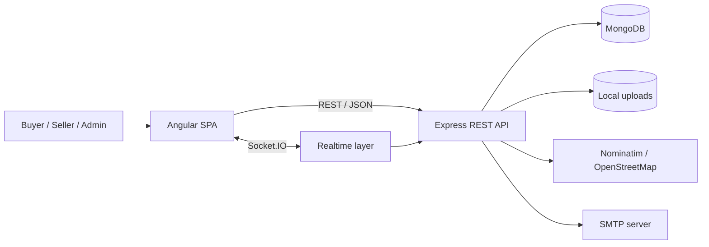
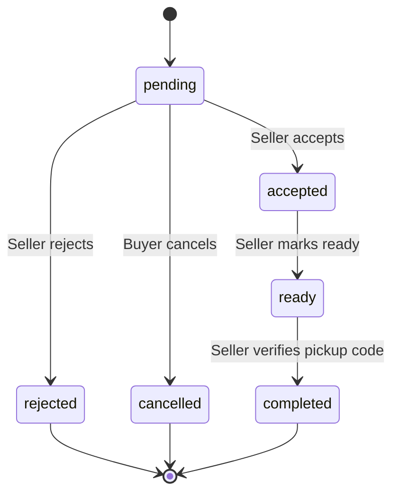
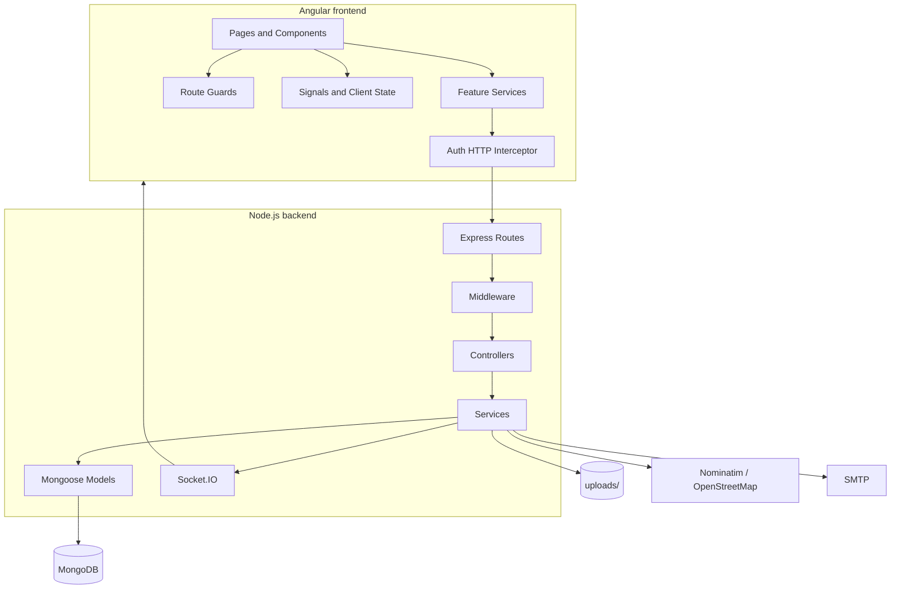

# Kuvam

[](https://github.com/rajcic-djordje/kuvam-fullstack-project/actions/workflows/ci.yml)

**Kuvam** is a full-stack web platform that connects local home cooks and food makers with buyers in the same area. It covers the complete workflow from discovering a local seller and browsing available food, through ordering and order tracking, to in-person pickup, pickup confirmation, reviews, reports, and administration.

The project is organized as a monorepo with a standalone Angular frontend, a Node.js/Express REST API, MongoDB persistence, real-time Socket.IO notifications, location features based on Leaflet and OpenStreetMap/Nominatim, and a dedicated QA layer with test documentation, automated API testing and Selenium-based end-to-end web testing. A GitHub Actions CI pipeline automatically verifies the frontend build, API regression suite and browser-based web tests.

> **Core domain idea:** Kuvam is not a delivery marketplace. Sellers are local people preparing food, each seller has one pickup location, and the buyer personally collects the order from the seller.

---

## Table of contents

- [Project overview](#project-overview)
- [Core features](#core-features)
- [User roles](#user-roles)
- [Main business flows](#main-business-flows)
  - [Registration and authentication](#1-registration-and-authentication)
  - [Buyer location and local browsing](#2-buyer-location-and-local-browsing)
  - [Cart and order creation](#3-cart-and-order-creation)
  - [Order lifecycle](#4-order-lifecycle)
  - [Pickup and pickup code](#5-pickup-and-pickup-code)
  - [Seller onboarding and approval](#6-seller-onboarding-and-approval)
  - [Reviews](#7-reviews)
  - [Reports and moderation](#8-reports-and-moderation)
- [System architecture](#system-architecture)
- [Technology stack](#technology-stack)
- [Frontend architecture](#frontend-architecture)
- [Backend architecture](#backend-architecture)
- [Data model](#data-model)
- [API overview](#api-overview)
- [Authentication and security](#authentication-and-security)
- [Real-time notifications](#real-time-notifications)
- [Location, maps and privacy](#location-maps-and-privacy)
- [Image uploads](#image-uploads)
- [Validation and error handling](#validation-and-error-handling)
- [QA and testing](#qa-and-testing)
- [Continuous integration](#continuous-integration)
- [Local development setup](#local-development-setup)
- [Environment variables](#environment-variables)
- [Seed data](#seed-data)
- [Build and deployment](#build-and-deployment)
- [Project structure](#project-structure)
- [Intentional scope limitations](#intentional-scope-limitations)
- [Important implementation decisions](#important-implementation-decisions)
- [Current project status](#current-project-status)
- [Author and license](#author-and-license)

---

# Project overview

Kuvam is designed around a realistic local food ordering and pickup process.

Instead of modeling sellers as traditional stores with multiple branches, the application treats them as **local food makers / home cooks**. A seller has one pickup location and publishes food that is currently available in a limited quantity.

The platform solves several domain problems:

- buyers get one place to discover local food makers and their currently available offers;
- sellers can publish food with an explicit available quantity;
- one order is tied to exactly one seller and therefore one pickup location;
- exact private pickup information is not unnecessarily exposed during public browsing;
- the order has a strict lifecycle that follows the real preparation and pickup process;
- pickup is confirmed with a dedicated pickup code;
- both sides receive order-related notifications;
- completed orders can be reviewed and reported;
- administrators control seller approval and user moderation.

## High-level system flow



The frontend is responsible for presentation, navigation, client-side state and user interaction. The backend remains authoritative for authentication, authorization, validation and business rules.

---

# Core features

## Buyer features

A buyer can:

- register and log in;
- restore an existing authenticated session;
- request a password-reset code by email;
- reset a forgotten password;
- configure a city and address;
- browse local sellers and available food;
- search sellers and offers;
- filter food by category;
- view seller profiles;
- view individual offers;
- add offers to a persistent cart;
- change item quantities;
- create an order;
- view active and historical orders;
- cancel a pending order;
- see pickup information when the order reaches an allowed state;
- receive the pickup code when the order is ready;
- notify the seller with **“Kreni po porudžbinu”** / “I am on the way”;
- receive persistent and real-time notifications;
- review a successfully completed order;
- report a problem related to a completed order;
- update profile data;
- change the password;
- deactivate and later reactivate the account.

## Seller features

A seller can:

- register a seller account;
- maintain a seller profile;
- set a business/display name and description;
- configure one pickup location;
- upload a profile image;
- upload a cover image;
- control whether new orders are currently being accepted;
- enter the administrator approval process;
- create offers after approval;
- edit offers;
- set the available quantity;
- activate and deactivate offers;
- upload and remove offer images;
- view incoming orders;
- filter and open received orders;
- accept an order and provide an estimated pickup time;
- reject a pending order with a reason;
- mark an accepted order as ready;
- receive a notification when the buyer starts traveling to the pickup point;
- complete an order by verifying the buyer's pickup code;
- report a problem connected to a completed order.

## Administrator features

An administrator has a separate admin workflow and can:

- log in through a dedicated admin login;
- view dashboard statistics;
- inspect recent system activity;
- review pending seller applications;
- approve seller applications;
- reject seller applications;
- browse user accounts;
- inspect suspended accounts;
- suspend users with a reason;
- remove suspensions;
- ban users;
- unban users;
- inspect reports;
- filter/search reports;
- approve confirmed reports;
- reject reports;
- track user offences;
- rely on automatic banning after the configured confirmed-offence threshold is reached.

---

# User roles

The system uses three roles.

| Role | Purpose | Main capabilities |
|---|---|---|
| `buyer` | Customer | browse, cart, ordering, pickup, reviews, reports, personal location |
| `seller` | Local food maker | seller profile, offers, received orders, pickup confirmation |
| `admin` | Platform administrator | seller approval, account moderation, reports and dashboard |

Role-based access is enforced by the backend. Angular route guards improve navigation and user experience, but they are **not** treated as the security boundary.

## User account states

A user account can be:

| Status | Meaning |
|---|---|
| `active` | normal account |
| `suspended` | temporarily blocked by administration |
| `deactivated` | voluntarily deactivated account |
| `banned` | administratively banned account |

Authenticated HTTP and Socket.IO flows verify the current user state on the server.

---

# Main business flows

## 1. Registration and authentication

### Buyer registration

A buyer registers with basic identity, email and password information. The public registration endpoint only accepts the `buyer` and `seller` roles, so an administrator cannot be created through normal registration.

### Seller registration

When a user registers with the `seller` role:

1. the `User` document is created;
2. a linked `Seller` profile is created;
3. if seller-profile creation fails, the newly created user is removed so the registration does not remain partially completed;
4. the seller must later satisfy the profile requirements and administrative approval flow before becoming publicly available.

### Separate administrator login

Administrators do not use the normal buyer/seller login endpoint. A dedicated admin login endpoint and Angular page keep the administrative workflow separated from the regular user-facing authentication flow.

### Login result

After a successful login, the client receives:

- an **access token**;
- sanitized current-user information;
- a **refresh token** through an HTTP-only cookie.

The Angular application keeps the access token in application memory instead of browser `localStorage`.

### Session restoration

When the Angular application starts, it attempts to restore an existing authenticated session before authentication initialization is considered complete.

The application uses the refresh cookie to request:

- a new access token;
- refreshed user information;
- a rotated refresh token.

This avoids requiring the user to log in again after every page reload while keeping the long-lived refresh credential unavailable to ordinary browser JavaScript.

### Refresh-token rotation

Refresh sessions are stored separately in MongoDB.

The server stores the **hash** of each refresh token, not the raw token.

During refresh:

1. the received token is hashed;
2. the corresponding refresh session is loaded;
3. revoked and expired sessions are rejected;
4. the old session is revoked;
5. a new refresh token and database session are created;
6. a new access token is issued.

If reuse of a previously revoked refresh token is detected, the backend revokes the user's remaining active refresh sessions.

### Account-status checks

Login and refresh reject accounts that are currently:

- suspended;
- banned;
- deactivated.

A deactivated buyer or seller can use the dedicated reactivation flow after providing valid credentials.

### Password hashing

Passwords are hashed with **bcrypt** using a work factor of 12.

Plain-text passwords are never stored in the database.

### Forgot-password flow

The password-reset process is email-based:

1. the user submits an email address;
2. the server generates a six-digit reset code;
3. the code is hashed with bcrypt before persistence;
4. the code is sent using the configured SMTP service;
5. the reset code expires after 15 minutes;
6. resending is protected by a 60-second cooldown;
7. invalid code attempts are counted;
8. too many unsuccessful attempts are rejected;
9. a successful password reset replaces the password hash;
10. existing refresh sessions are revoked.

The forgot-password endpoint intentionally returns a generic success message even when the submitted email is not registered. This avoids exposing account existence through the API.

---

## 2. Buyer location and local browsing

Kuvam distinguishes between:

- a buyer's personal location;
- a seller's pickup location;
- a privacy-preserving seller location shown publicly.

### Buyer location

A buyer can store:
- city;
- street;
- street number;
- additional address information;
- latitude;
- longitude.

Only users with the `buyer` role may update their location through the buyer-location endpoint.

### Address geocoding

The backend geocodes buyer addresses instead of trusting coordinates supplied directly by the buyer-location form.

The geocoding service uses **Nominatim / OpenStreetMap** and sends:

- Serbia as the country;
- the configured city;
- street and street number;
- a project-specific User-Agent;
- a 10-second request timeout.

The service converts the matching result to numeric latitude and longitude.

Expected geocoding failures are translated into API errors such as:

- address not found;
- geocoding service unavailable;
- invalid geocoding response.

### City-aware browsing

Public browsing supports both anonymous and authenticated visitors.

When a request contains a valid authenticated user, optional authentication attaches the user's `cityId` to the request context.

Public seller/offer listing can therefore apply a city filter when the user has a configured city.

The public listing also filters out sellers that should not currently be browsable. A seller must have, among other required data:

- an active seller user account;
- an approved seller profile;
- enabled order acceptance;
- a city;
- required pickup-address fields.

Public offer results additionally require the offer to be active and have `availableQuantity > 0`.

### Search and category filters

Seller discovery supports matching against seller and offer information. Offer discovery supports search and category filtering.

Food categories currently include:

- cooked meals;
- soups and stews;
- grilled and roasted food;
- bakery products and pies;
- desserts;
- salads and side dishes;
- preserved food;
- breakfast and snacks;
- drinks;
- other.

---

## 3. Cart and order creation

The cart is a frontend feature implemented as reactive Angular state and persisted in `localStorage` under the `kuvam-cart` key.

Persistence allows the cart to survive an ordinary browser refresh.

### Cart state

The cart tracks:

- current seller;
- selected offers;
- current quantities;
- unit prices;
- currently known available quantities.

Computed state provides:

- total number of items;
- total cart price.

### One seller per order

A single order may contain multiple food items, but all items must belong to **the same seller**.

This rule exists at multiple levels.

#### Frontend protection

When the cart already contains items from one seller, attempting to add an offer belonging to another seller returns a `different-seller` result. The UI can then require explicit replacement of the current cart.

#### Backend protection

The server independently loads every referenced offer and verifies that all offers have the same seller ID.

Therefore bypassing the Angular cart cannot create a multi-seller order.

### Quantity synchronization

The cart can synchronize an existing item with current offer data.

If an offer becomes:

- inactive; or
- out of stock,

the corresponding cart item is removed.

If the available quantity becomes smaller than the quantity currently stored in the cart, the requested quantity is clamped to the new maximum.

### Server-authoritative pricing

The backend does not trust price totals from the browser.

During order creation it reloads the referenced offers from MongoDB and constructs order-item snapshots containing:

- offer reference;
- name;
- category;
- image;
- ordered quantity;
- unit;
- unit price;
- calculated item total.

The order total is computed by the backend from these values.

### Atomic stock reservation

For each requested item, stock is reduced using a conditional atomic MongoDB update.

The update only succeeds when:

- the offer is still active;
- `availableQuantity` is still greater than or equal to the requested amount.

This prevents two concurrent requests from both successfully consuming the same final units of inventory.

### Partial rollback

If order creation fails after one or more offer quantities have already been reduced, the backend attempts to restore the quantities already reserved by that failed request.

### Notification is not the order transaction

Creating the order and reserving quantities is the primary business operation.

The `new_order` notification is created only after the order itself has successfully persisted.

If notification creation fails after that point:

- the order remains valid;
- stock remains reserved;
- the notification failure is logged.

This prevents a valid order from remaining in the database while its stock is incorrectly returned.

---

## 4. Order lifecycle

Current order statuses are:

| Status | Meaning |
|---|---|
| `pending` | created by the buyer and waiting for seller action |
| `accepted` | accepted by the seller with an estimated pickup time |
| `rejected` | rejected by the seller |
| `ready` | prepared and ready for pickup |
| `completed` | pickup successfully confirmed |
| `cancelled` | cancelled by the buyer while still pending |

### State-transition diagram



### Pending order

Immediately after creation, an order is `pending`.

The seller receives a `new_order` notification.

### Buyer cancellation

A buyer may cancel only an order that is still `pending`.

The transition uses a status condition in the database update, so a concurrent request cannot independently cancel the same order after another transition has already happened.

After cancellation:

- the status becomes `cancelled`;
- reserved quantities are restored to the related offers.

If quantity restoration itself fails, the service attempts to roll the order status back to `pending` rather than leaving the order cancelled without restoring inventory.

### Seller rejection

A seller may reject only a `pending` order.

A rejection stores the provided `rejectionReason`.

After rejection:

- the status becomes `rejected`;
- reserved quantities are restored;
- the buyer receives an `order_rejected` notification.

The transition is conditional on the current `pending` state, preventing multiple concurrent rejections from restoring inventory more than once.

If quantity restoration fails, the service attempts to restore:

- status back to `pending`;
- `rejectionReason` back to `null`.

### Seller acceptance

A seller may accept only a `pending` order.

Acceptance:

- changes the status to `accepted`;
- stores `estimatedPickupAt`;
- sends an `order_accepted` notification to the buyer.

### Ready state

Only an `accepted` order can be moved to `ready`.

When this happens:

- `pickupCodeGeneratedAt` is set;
- previous code-attempt state is reset;
- the buyer receives an `order_ready` notification.

### Completed state

Only a `ready` order can become `completed`.

Completion requires successful pickup-code verification.

After completion:

- pickup attempt counters are reset;
- temporary blocking is cleared;
- status becomes `completed`;
- the buyer receives an `order_completed` notification.

---

## 5. Pickup and pickup code

The pickup flow is designed so that the seller does **not** receive the code that the seller is expected to verify.

### Pickup information visibility

The exact seller pickup address is hidden from the buyer's order response while the order is not in an allowed pickup state.

The exact pickup address becomes available when the order status is:

- `accepted`;
- `ready`;
- `completed`.

This prevents the exact private pickup address from being exposed before a seller has accepted the order.

### Pickup-code generation

When the seller marks an order as ready, the backend stores the code-generation timestamp.

The current pickup code is a **six-digit numeric code**.

The code itself is not stored as a plain-text field in the order document.

Instead, it is derived from:

- order ID;
- pickup-code generation timestamp;
- server-side `PICKUP_CODE_SECRET`;
- HMAC-SHA256.

Conceptually:

```text
HMAC_SHA256(
    PICKUP_CODE_SECRET,
    "<orderId>:<generatedAtTimestamp>"
)
    -> numeric reduction
    -> 6-digit code
```

### Buyer-only code exposure

The buyer order-detail response includes the generated pickup code only while the order is `ready` and code generation has occurred.

Seller order-detail responses remove internal pickup-code metadata.

### “On the way” action

A buyer may notify the seller that they have started traveling to the pickup point only when the order is `ready`.

The action:

- stores `buyerOnTheWayAt`;
- can only be performed once per order;
- creates a `buyer_on_the_way` notification for the seller.

### Pickup verification

At pickup, the buyer provides the code to the seller.

The seller submits the code to the order-completion endpoint.

Code comparison uses `crypto.timingSafeEqual`.

### Failed-attempt protection

Pickup verification includes brute-force protection:

- maximum incorrect attempts: **5**;
- after the limit is reached, verification is blocked for **15 minutes**;
- when the blocking period expires, the attempt state can be reset;
- successful verification clears the attempt and block state.

---

## 6. Seller onboarding and approval

Seller-specific domain information is stored separately from the base user account.

A seller profile contains:

- linked `User`;
- `businessName`;
- unique public `slug`;
- description;
- profile image;
- cover image;
- city;
- one pickup address;
- pickup latitude and longitude;
- `isOpen` internal state;
- approval status;
- rejection reason.

### Seller profile completeness

The backend can determine whether a seller profile is complete based on required information such as:

- business name;
- description;
- city;
- pickup street;
- pickup street number;
- pickup coordinates.

### Approval statuses

Seller approval supports these states:

- `pending`;
- `approved`;
- `rejected`;
- `suspended`.

### Admin approval flow

An administrator can:

1. load pending seller applications;
2. inspect the application;
3. approve the seller; or
4. reject the application with validated rejection information.

Unapproved sellers are excluded from normal public seller/offer browsing.

### Seller slug

Public seller profiles use a human-readable slug.

The slug is derived from `businessName` by:

- Unicode normalization;
- diacritic removal;
- lowercase conversion;
- replacement of non-alphanumeric sequences with `-`;
- trimming leading/trailing hyphens.

If the same slug is already used, the service appends a numeric suffix until a unique value is found.

### Accepting new orders

The backend model uses the internal boolean field `isOpen`.

In the user interface this is presented as the seller's **order-acceptance state**, rather than as traditional store opening hours.

When order acceptance is disabled:

- the seller is excluded from normal public discovery;
- new order creation is rejected.

---

## 7. Reviews

Reviews are tied to actual completed orders rather than arbitrary public profiles.

A review can be created only when:

- the authenticated user is the buyer that owns the order;
- the order exists;
- the order status is `completed`;
- the order has not already been reviewed.

One order can therefore create at most one review.

The review stores:

- buyer reference;
- seller reference;
- primary offer reference;
- order reference;
- rating;
- comment.

### Public seller reviews

The public review endpoint returns:

- `reviewsCount`;
- `averageRating`;
- review list;
- basic buyer information;
- relevant offer information.

---

## 8. Reports and moderation

Reports are also tied to real completed transactions.

A buyer or seller may create a report only for a `completed` order in which that user was actually a participant.

### Who gets reported?

If the reporter is the buyer:

- the reported user is the user account behind the order's seller.

If the reporter is the seller:

- the reported user is the order's buyer.

This keeps moderation attached to actual transaction participants.

### Duplicate protection

The same reporter cannot create multiple reports for the same order.

### Report reasons

Supported report reasons are:

| Code | Meaning |
|---|---|
| `no_show` | participant did not show up |
| `inappropriate_behavior` | inappropriate behavior |
| `misleading_information` | misleading information |
| `food_quality_or_safety` | food quality or safety |
| `payment_issue` | payment-related problem |
| `other` | other issue |

### Report lifecycle

A report can be:

- `pending`;
- `approved`;
- `rejected`.

Administrators can inspect report details and add an administrative note while processing the report.

### Confirmed offences

When an administrator approves a report:

- `offences` is incremented;
- `offencesSinceLastBan` is incremented.

The current automatic-ban threshold is:

```text
3 confirmed offences
```

Once the threshold is reached:

- the reported account becomes `banned`;
- an automatic ban reason is recorded;
- suspension data is cleared;
- active refresh sessions are revoked.

---

# System architecture

Kuvam separates the application into frontend, API/business logic, persistence and external integrations.



## Typical backend request pipeline

A protected API request usually follows this path:

```text
Route
  -> authenticate
  -> authorize(role)
  -> validateObjectId / validateQuery / validateBody
  -> controller
  -> service
  -> Mongoose model
  -> MongoDB
  -> HTTP response
```

The controller layer is intentionally thin. Domain rules are concentrated in service modules rather than being duplicated in route handlers or controllers.

---

# Technology stack

## Frontend

| Technology | Purpose |
|---|---|
| **Angular 21** | single-page application framework |
| **TypeScript 5.9** | typed frontend code |
| **Angular Router** | navigation and protected routes |
| **Angular Signals** | reactive client-side state |
| **RxJS 7.8** | HTTP/session asynchronous flows |
| **Leaflet 1.9** | interactive map UI |
| **Socket.IO Client 4.8** | real-time notifications |
| **Lucide Angular** | UI icons |
| **CSS** | responsive component styling and design system |

## Backend

| Technology | Purpose |
|---|---|
| **Node.js 22** | JavaScript runtime |
| **Express 5** | REST API |
| **MongoDB** | document database |
| **Mongoose 9** | ODM, schemas and persistence |
| **Socket.IO 4.8** | real-time events |
| **Zod 4** | request validation |
| **jsonwebtoken 9** | JWT access tokens |
| **bcrypt 6** | password and reset-code hashing |
| **Multer 2** | image uploads |
| **Nodemailer 9** | password-reset email |
| **Helmet 8** | HTTP security headers |
| **CORS** | frontend-origin policy |
| **cookie-parser** | refresh-cookie handling |

## QA

| Technology | Purpose |
|---|---|
| **Java 24** | API and web test automation |
| **Maven** | build/dependency management |
| **Rest Assured 6.0.1** | HTTP API automation |
| **Selenium WebDriver 4.47.0** | browser-based end-to-end web testing |
| **TestNG 7.12.0** | test runner and assertions |
| **Jackson 3.2.1** | JSON response mapping |
| **Firefox / GeckoDriver** | browser execution for Selenium tests |
| **GitHub Actions** | continuous integration and automated regression execution |

---

# Frontend architecture

The frontend uses a **feature-first structure**.

Current top-level feature areas are:

```text
admin
auth
cart
home
location
notifications
offers
orders
profile
reports
reviews
```

The application also contains:

```text
core/       global guards, interceptors and constants
layouts/    main user layout and admin layout
shared/     reusable application-level UI
features/   domain-oriented feature modules
```

## Angular configuration

The application uses standalone Angular configuration.

`app.config.ts` provides:

- the router;
- Angular `HttpClient`;
- the authentication interceptor;
- browser global error listeners;
- an application initializer that restores the session before auth initialization is completed.

## Main user routes

The main layout contains routes such as:

```text
/
 /offers
 /offers/:offerId
 /sellers/:slug
 /profile
 /orders
 /orders/:orderId
 /seller/orders
 /seller/orders/:orderId
 /seller/offers
 /seller/offers/new
 /seller/offers/:offerId/edit
```

## Authentication routes

```text
/login
/register
/forgot-password
```

Guest guards prevent inappropriate access to guest-only screens after authentication.

## Administrator routes

```text
/admin/login

/admin/dashboard
/admin/users
/admin/banned-users
/admin/pending-sellers
/admin/suspensions
/admin/reports
```

The `/admin` layout is protected by an admin guard and redirects its empty child path to the dashboard.

## Role-specific route guards

The project separates several frontend navigation concerns:

- `authGuard`
- `guestGuard`
- `userGuard`
- `buyerGuard`
- `sellerGuard`
- `adminGuard`
- `adminGuestGuard`

Again, these guards are an application-navigation layer. Backend authorization remains the final security check.

## Authentication state

`AuthService` stores:

- current access token;
- current user;
- auth initialization state.

These values use Angular signals.

The service also prevents duplicate concurrent refresh requests by sharing an in-flight refresh Observable.

## API base URL

For local/LAN development, the frontend derives the backend host from the current browser hostname and uses port `3000`.

Conceptually:

```text
http://<current-browser-host>:3000/api/v1
```

The Socket.IO connection uses the same backend host.

---

# Backend architecture

The backend is organized by responsibility.

```text
backend/src/
├── app.js
├── config/
├── constants/
├── controllers/
├── errors/
├── middleware/
├── models/
├── routes/
├── scripts/
├── services/
├── utils/
└── validators/
```

## `config/`

Contains infrastructure configuration such as:

- environment parsing and validation;
- MongoDB connection handling;
- Socket.IO configuration.

## `constants/`

Contains domain constants such as:

- user roles and statuses;
- seller approval statuses;
- offer categories;
- order statuses;
- report statuses/reasons;
- notification types.

## `controllers/`

Controllers translate HTTP requests into service calls and construct HTTP responses.

They are not used as the primary location for complex domain logic.

## `middleware/`

Includes reusable request-pipeline behavior such as:

- required authentication;
- optional authentication;
- role authorization;
- request-body validation;
- query validation;
- ObjectId validation;
- image uploads;
- centralized error handling.

## `models/`

Current persisted domain models include:

- `User`
- `Seller`
- `Offer`
- `Order`
- `Review`
- `Report`
- `Notification`
- `RefreshSession`
- `City`

## `routes/`

Routes group the REST API by business domain:

- auth;
- users;
- sellers;
- offers;
- orders;
- reviews;
- reports;
- notifications;
- cities;
- admin auth;
- admin seller approval;
- admin user moderation;
- admin dashboard.

## `services/`

Services contain the core business logic.

Examples include:

- authentication/session rules;
- seller-profile logic;
- offer availability;
- order state transitions;
- report moderation;
- review constraints;
- notifications;
- geocoding;
- admin statistics.

## `utils/`

Contains technical helpers such as:

- JWT helpers;
- refresh-token helpers;
- pickup-code generation;
- public seller-location obfuscation.

## `validators/`

Request payload and query validation is defined through Zod schemas and applied before business services are invoked.

---

# Server lifecycle

`server.js` is the backend entry point.

Startup order:

1. connect to MongoDB;
2. create an HTTP server around the Express application;
3. initialize Socket.IO using the same HTTP server;
4. listen on the configured port.

The process also handles graceful shutdown.

On `SIGINT` or `SIGTERM` it attempts to:

1. stop Socket.IO;
2. close the HTTP server;
3. disconnect MongoDB;
4. set an appropriate process exit code.
---

# Express application configuration

The Express application configures:

- `helmet()`;
- controlled CORS;
- credential support;
- JSON parsing;
- cookie parsing;
- static image serving;
- API routes;
- a fallback 404 response;
- centralized error handling.

## Health endpoint

```http
GET /api/v1/health
```

Successful response:

```json
{
  "status": "ok",
  "message": "Kuvam API is running"
}
```

## Development CORS behavior

The configured `CLIENT_ORIGIN` is explicitly allowed.

In development mode the backend also permits Angular development origins from private LAN ranges on port `4200`, allowing the frontend to be tested from another device on the same local network.

---

# Data model

## User

`User` represents the platform account.

Important data includes:

- first name;
- last name;
- email;
- password hash;
- role;
- account status;
- report count;
- total offences;
- offences since the last ban;
- suspension information;
- ban reason;
- password-reset state;
- city;
- buyer address and coordinates.

Seller-specific business information does not live directly in `User`.

## Seller

`Seller` is a profile linked one-to-one to a seller-role `User`.

Important fields include:

- `user`;
- `businessName`;
- `slug`;
- `description`;
- `profileImageUrl`;
- `coverImageUrl`;
- `city`;
- `pickupAddress`;
- `isOpen`;
- `approvalStatus`;
- `rejectionReason`.

Each seller has exactly **one** pickup location.

## City

`City` provides controlled city data used by buyer and seller location flows.

Public browse filtering can use city IDs rather than arbitrary user-entered city strings.

## Offer

An offer belongs to one seller.

An offer contains data such as:

- name;
- description;
- category;
- price;
- available quantity;
- unit;
- image;
- active/inactive state.

### Offer categories

Current internal category values are:

```text
cooked_meals
soups_and_stews
grilled_and_roasted
bakery_and_pies
desserts
salads_and_sides
preserved_food
breakfast_and_snacks
drinks
other
```

## Order

An order links one buyer and one seller.

It stores:

- buyer reference;
- seller reference;
- item snapshots;
- total price;
- status;
- buyer note;
- rejection reason;
- estimated pickup time;
- buyer-on-the-way timestamp;
- pickup-code generation metadata;
- pickup verification attempt state.

### Order item snapshot

Each order item stores:

- original offer reference;
- offer name;
- category;
- image URL;
- ordered quantity;
- unit;
- unit price at order time;
- item total at order time.

This snapshot keeps order history meaningful even when the original offer is later edited.

## Review

A review relates:

- buyer;
- seller;
- primary offer;
- completed order;
- rating;
- comment.

## Report

A report contains:

- reporter;
- reported user;
- related order;
- reason;
- description;
- status;
- reviewing admin;
- admin note;
- review timestamp.

## Notification

A notification is persisted for a specific user and can optionally reference an order.

It also stores read/unread state.

## RefreshSession

Refresh sessions are stored separately from user accounts.

A refresh-session record tracks:

- user;
- hash of the token;
- expiration;
- revocation;
- replacement-token relationship when rotated.

---

# API overview

All routes are mounted under:

```text
/api/v1
```

Local development typically uses:

```text
http://localhost:3000/api/v1
```

## Health

| Method | Endpoint | Access | Description |
|---|---|---|---|
| `GET` | `/health` | Public | API health check |

## Authentication

| Method | Endpoint | Access | Description |
|---|---|---|---|
| `POST` | `/auth/register` | Public | buyer/seller registration |
| `POST` | `/auth/login` | Public | regular user login |
| `POST` | `/auth/reactivate` | Public | reactivate a deactivated account |
| `POST` | `/auth/forgot-password` | Public | request password-reset code |
| `POST` | `/auth/reset-password` | Public | reset password using code |
| `POST` | `/auth/refresh` | Refresh cookie | rotate refresh session and issue access token |
| `POST` | `/auth/logout` | Refresh cookie | revoke refresh session |
| `POST` | `/admin/auth/login` | Public | dedicated administrator login |

## Current user

| Method | Endpoint | Access | Description |
|---|---|---|---|
| `GET` | `/users/me` | Authenticated | current user profile |
| `PATCH` | `/users/me` | Authenticated | update profile |
| `PATCH` | `/users/me/password` | Authenticated | change password |
| `PATCH` | `/users/me/deactivate` | Authenticated | deactivate own account |
| `PATCH` | `/users/me/location` | Buyer | update buyer location |

## Cities

| Method | Endpoint | Access | Description |
|---|---|---|---|
| `GET` | `/cities` | Public | active city list |

## Sellers

| Method | Endpoint | Access | Description |
|---|---|---|---|
| `GET` | `/sellers` | Public / optional auth | public seller listing |
| `GET` | `/sellers/:slug` | Public | public seller page |
| `GET` | `/sellers/me` | Seller | private seller profile |
| `PATCH` | `/sellers/me` | Seller | update seller profile |
| `PATCH` | `/sellers/me/profile-image` | Seller | upload profile image |
| `DELETE` | `/sellers/me/profile-image` | Seller | remove profile image |
| `PATCH` | `/sellers/me/cover-image` | Seller | upload cover image |
| `DELETE` | `/sellers/me/cover-image` | Seller | remove cover image |

## Offers

| Method | Endpoint | Access | Description |
|---|---|---|---|
| `GET` | `/offers` | Public / optional auth | available offers |
| `GET` | `/offers/:offerId` | Public | offer detail |
| `GET` | `/offers/mine` | Seller | seller's own offers |
| `POST` | `/offers` | Seller | create offer |
| `PATCH` | `/offers/:offerId` | Seller/owner | update offer |
| `PATCH` | `/offers/:offerId/activate` | Seller/owner | activate offer |
| `PATCH` | `/offers/:offerId/deactivate` | Seller/owner | deactivate offer |
| `PATCH` | `/offers/:offerId/image` | Seller/owner | upload offer image |
| `DELETE` | `/offers/:offerId/image` | Seller/owner | remove offer image |
| `DELETE` | `/offers/:offerId` | Seller/owner | delete offer when business rules allow |

## Buyer orders

| Method | Endpoint | Access | Description |
|---|---|---|---|
| `POST` | `/orders` | Buyer | create order |
| `GET` | `/orders/mine` | Buyer | list buyer orders |
| `GET` | `/orders/mine/:orderId` | Buyer/owner | buyer order detail |
| `PATCH` | `/orders/mine/:orderId/cancel` | Buyer/owner | cancel pending order |
| `PATCH` | `/orders/mine/:orderId/on-the-way` | Buyer/owner | notify seller that buyer is on the way |

## Seller orders

| Method | Endpoint | Access | Description |
|---|---|---|---|
| `GET` | `/orders/received` | Seller | received orders |
| `GET` | `/orders/received/:orderId` | Seller/owner | received-order detail |
| `PATCH` | `/orders/received/:orderId/accept` | Seller/owner | accept pending order |
| `PATCH` | `/orders/received/:orderId/reject` | Seller/owner | reject pending order |
| `PATCH` | `/orders/received/:orderId/ready` | Seller/owner | mark accepted order ready |
| `PATCH` | `/orders/received/:orderId/complete` | Seller/owner | complete order with pickup code |

## Reviews
| Method | Endpoint | Access | Description |
|---|---|---|---|
| `POST` | `/reviews` | Buyer | review a completed order |
| `GET` | `/reviews/seller/:sellerId` | Public | seller reviews and rating summary |

## Reports

| Method | Endpoint | Access | Description |
|---|---|---|---|
| `POST` | `/reports` | Buyer / Seller | report the opposite participant of a completed order |
| `GET` | `/reports/admin` | Admin | list/search/filter reports |
| `GET` | `/reports/admin/pending` | Admin | pending reports |
| `PATCH` | `/reports/admin/:reportId/approve` | Admin | confirm report |
| `PATCH` | `/reports/admin/:reportId/reject` | Admin | reject report |

## Notifications

| Method | Endpoint | Access | Description |
|---|---|---|---|
| `GET` | `/notifications` | Authenticated | latest notifications |
| `GET` | `/notifications/unread-count` | Authenticated | unread count |
| `PATCH` | `/notifications/read-all` | Authenticated | mark all as read |
| `PATCH` | `/notifications/:notificationId/read` | Authenticated/owner | mark one as read |

## Seller administration

| Method | Endpoint | Access | Description |
|---|---|---|---|
| `GET` | `/admin/sellers/pending` | Admin | pending seller applications |
| `PATCH` | `/admin/sellers/:sellerId/approve` | Admin | approve seller |
| `PATCH` | `/admin/sellers/:sellerId/reject` | Admin | reject seller |

## User administration

| Method | Endpoint | Access | Description |
|---|---|---|---|
| `GET` | `/admin/users` | Admin | user-account listing |
| `GET` | `/admin/users/suspended` | Admin | suspended accounts |
| `PATCH` | `/admin/users/:userId/suspend` | Admin | suspend user |
| `PATCH` | `/admin/users/:userId/unsuspend` | Admin | remove suspension |
| `PATCH` | `/admin/users/:userId/ban` | Admin | ban user |
| `PATCH` | `/admin/users/:userId/unban` | Admin | unban user |

## Admin dashboard

| Method | Endpoint | Access | Description |
|---|---|---|---|
| `GET` | `/admin/dashboard` | Admin | statistics, pending items and recent activity |

---

# Authentication and security

Security is implemented in several independent layers.

## JWT access token

The access token is sent as:

```http
Authorization: Bearer <access-token>
```

For an authenticated request the backend:

1. validates the authorization format;
2. verifies the JWT;
3. loads the current user from MongoDB;
4. verifies the account status;
5. attaches authenticated identity and role to the request.

This means a previously issued token does not allow a newly suspended, banned or deactivated account to continue using authenticated endpoints indefinitely.

## Refresh-token cookie

The refresh token is stored in an HTTP-only cookie.

Current cookie characteristics include:

- `HttpOnly`;
- `SameSite=Strict`;
- `Secure` in production;
- explicit expiration;
- path restricted to `/api/v1/auth`.

## Refresh-token hashing

Raw refresh tokens are not stored in MongoDB.

The backend stores a token hash and uses rotation/revocation records to manage session lifecycle.

## Session revocation

Refresh sessions are revoked when appropriate, including:

- logout;
- password change;
- successful forgot-password reset;
- administrative ban;
- other account-level security flows.

## Password storage

Passwords use bcrypt hashing.

Database models do not expose the password hash through ordinary queries.

## Role authorization

Backend route middleware explicitly protects buyer, seller and admin operations.

Examples:

```text
POST /orders                         -> buyer
GET  /orders/received                -> seller
GET  /admin/dashboard                -> admin
POST /reports                        -> buyer or seller
```

## Resource ownership

Role checks are combined with ownership checks.

Examples:

- a buyer only reads their own order;
- a seller only updates their own offer;
- a seller only operates on orders belonging to their seller profile;
- notification read operations are restricted to the notification recipient.

## HTTP security

The Express application uses Helmet security headers.

CORS accepts configured origins and uses credential support only through the application policy.

## Privacy-aware API responses

Sensitive pickup data is selectively removed from responses.

In particular:

- public seller browsing does not expose the exact pickup point;
- buyer order detail hides pickup address before the order reaches an allowed state;
- seller order responses do not expose the buyer's pickup code.

---

# Real-time notifications

Kuvam combines **persistent MongoDB notifications** with **Socket.IO delivery**.

This design avoids a common real-time-only problem: if the recipient is offline when an event happens, the information is still stored and can be loaded later.

## Notification creation flow

```text
business event
   -> Notification.create(...)
   -> MongoDB persistence
   -> Socket.IO emit to recipient room
   -> live Angular UI update if connected
```

## Socket authentication

The Socket.IO handshake carries the current access token.

The server verifies:

- token validity;
- user existence;
- account status.

A valid socket joins a private room:

```text
user:<userId>
```

Notifications are then emitted only to the intended user's room.

## Client event

The live event name is:

```text
notification:new
```

## Notification types

Current domain events are:

| Type | Recipient / purpose |
|---|---|
| `new_order` | seller receives new order |
| `order_accepted` | buyer learns seller accepted |
| `order_rejected` | buyer learns seller rejected |
| `order_ready` | buyer learns order is ready |
| `buyer_on_the_way` | seller learns buyer started traveling |
| `order_completed` | buyer receives completion confirmation |

## Read state

The REST API supports:

- notification history;
- unread count;
- marking one notification as read;
- marking all notifications as read.

The default notification-list limit is 30 and the backend caps it at 100.

---

# Location, maps and privacy

Location is an important domain feature because pickup occurs at the seller's physical location.

At the same time, sellers may be operating from a private home address, so the public map must not reveal the exact pickup point unnecessarily.

## Three location concepts

Kuvam therefore distinguishes:

1. **buyer location** — used for local discovery;
2. **exact seller pickup location** — used for accepted orders and pickup;
3. **public seller location zone** — approximate area visible during public browsing.

## Buyer coordinates

The buyer enters an address and the backend geocodes it using Nominatim/OpenStreetMap.

## Seller pickup location

A seller has one city and one pickup address with coordinates.

There is no multi-branch or multi-pickup-location model.

## Public seller location obfuscation

The public profile uses a deterministic obfuscated location instead of the real coordinate.

The offset is derived from:

- seller ID;
- `PUBLIC_LOCATION_SECRET`;
- HMAC-SHA256.

Current parameters:

- generated offset distance: approximately **300–500 m**;
- public-zone radius: **650 m**.

The same seller therefore receives a stable approximate public area while the secret stays unchanged, but the actual pickup point is not directly exposed.

## Exact address disclosure

Once a legitimate buyer order has progressed into the pickup workflow, the API can return the exact pickup address.

Allowed buyer order states are:

```text
accepted
ready
completed
```

This creates a clear privacy boundary between browsing and an actual accepted transaction.

---

# Image uploads

Kuvam supports images for:

- seller profile;
- seller cover;
- individual offers.

Uploads are handled by Multer and saved to local backend storage.

## Offer image rules

Supported MIME types:

```text
image/jpeg
image/png
image/webp
```

Maximum offer image size:

```text
5 MB
```
Uploaded files receive a UUID-based server filename.

This prevents the original user-controlled filename from directly becoming the stored server filename.

## Static serving

The backend exposes files through:

```text
/uploads/...
```

The Express static route is configured with cross-origin resource policy suitable for frontend image display.

## Replacing and deleting images

Service logic tracks the previous image URL and removes old files when appropriate, avoiding unnecessary accumulation when an image is replaced or explicitly deleted.

---

# Validation and error handling

The API applies validation before service-level business logic whenever appropriate.

## Validation middleware

Important middleware includes:

```text
validateBody
validateQuery
validateObjectId
authenticate
optionalAuthenticate
authorize
```

Zod schemas define accepted request structures for domain operations such as:

- registration/login;
- profile changes;
- seller updates;
- offers;
- order creation;
- order acceptance/rejection;
- pickup verification;
- reports;
- admin actions.

## Application errors

Expected business errors use `AppError`.

An application error carries:

- HTTP status;
- stable error code;
- human-readable message.

Example error response:

```json
{
  "error": {
    "code": "ORDER_NOT_FOUND",
    "message": "Order not found."
  }
}
```

## Unexpected errors

Unexpected internal exceptions do not expose raw implementation details through the response.

The central error handler returns:

```json
{
  "error": {
    "code": "INTERNAL_SERVER_ERROR",
    "message": "Unexpected error occurred."
  }
}
```

The original exception is logged server-side for debugging.

---

# QA and testing

QA is maintained as a first-class part of the repository.

The `qa/` directory contains manual QA documentation together with two independent automated test projects:

- REST API regression testing with Rest Assured;
- end-to-end browser testing with Selenium WebDriver.

The automated suites exercise the application against real backend, frontend and MongoDB instances instead of mocked application flows.

## QA documentation

Current QA documentation includes:

```text
#Kuvam – Test Plan.md
#Kuvam – Test Scenarios.md
#Kuvam - Test Cases.md
#Kuvam - Test Execution Plan.md
#Kuvam - Test Execution.md
#Kuvam - Bug Report.md
#Kuvam - Test Report.md
```

The detailed test-case document contains the functional test cases used for project verification.

## Automated API testing

The Rest Assured project is located at:

```text
qa/kuvam-api-testing/
```

Its stack includes:

- Java 24;
- Maven;
- Rest Assured 6.0.1;
- TestNG 7.12.0;
- Jackson 3.2.1.

The automation project uses typed request/response DTOs and request-builder helpers around API calls.

## Covered API areas

The automated suite covers the major backend workflows, including:

- authentication;
- authorization;
- user-account behavior;
- seller behavior;
- offers;
- browsing filters;
- location;
- order creation;
- cancellation;
- seller accept/reject;
- invalid state transitions;
- ready flow;
- buyer on-the-way flow;
- pickup-information visibility;
- pickup-code verification and blocking;
- administration;
- reports;
- account-status behavior.

## Running API tests

The backend and expected test data must be available first.

From the API-testing project:

```bash
cd qa/kuvam-api-testing
mvn test
```

## Automated web testing

The Selenium WebDriver project is located at:

```text
qa/kuvam-web-testing/
```

Its stack includes:

- Java 24;
- Maven;
- Selenium WebDriver 4.47.0;
- TestNG 7.12.0;
- Firefox.

The project follows the **Page Object Model**. Browser interaction, locators and synchronization logic are kept inside Page Objects, while test classes focus on business flows and assertions.

Shared Page Object infrastructure provides:

- explicit waits for asynchronous UI behavior;
- page-load synchronization;
- reusable element interaction;
- handling of temporary toast overlays;
- isolated browser/session cleanup between tests.

Locators and reusable UI constants are separated from test-scenario data. Tests therefore avoid direct Selenium/DOM manipulation and interact with the application through Page Object APIs.

### Web test coverage

The current Selenium suite contains **10 end-to-end tests** covering representative buyer, seller, authentication and administration workflows.

Covered flows include:

- buyer registration and login;
- seller registration and pending approval state;
- buyer location configuration and seller discovery;
- cart and order creation;
- complete buyer/seller pickup workflow;
- review and report creation after completed orders;
- seller offer creation, activation, deactivation and deletion;
- seller order processing;
- administrator seller approval and user suspension;
- administrator report moderation.

Several scenarios deliberately switch between buyer, seller and administrator sessions in the same test so that complete cross-role business workflows are verified through the actual UI.

### Running web tests

The following services must be running first:

```text
MongoDB
backend  -> http://localhost:3000
frontend -> http://localhost:4200
```

The database should contain the expected seed data:

```bash
cd backend
npm run seed
```

Then run:

```bash
cd qa/kuvam-web-testing
mvn test
```

Firefox is used as the browser. During GitHub Actions execution it runs in headless mode.

## Verified project state

For the current finalized project state used to prepare this README:

- the complete automated API suite passes: **84/84 tests**;
- the complete Selenium web suite passes: **10/10 tests**;
- the Angular production build completes without errors;
- the complete GitHub Actions CI workflow passes successfully.

---

# Continuous integration

The repository includes a GitHub Actions workflow:

```text
.github/workflows/ci.yml
```

The CI pipeline runs automatically on:

- pushes to `main`;
- pull requests targeting `main`;
- manual execution through `workflow_dispatch`.

The workflow uses minimal repository permissions:

```yaml
permissions:
  contents: read
```

## CI pipeline

The pipeline is divided into three independent jobs:

```text
CI
├── Frontend Build
├── API Tests
└── Web Tests
```

### Frontend Build

The frontend job:

1. checks out the repository;
2. configures Node.js 22;
3. restores the npm dependency cache;
4. installs dependencies with `npm ci`;
5. executes the Angular production build.

### API Tests

The API job provisions an isolated MongoDB 8 service and then:

1. configures Node.js 22 and Java 24;
2. restores npm and Maven caches;
3. installs backend dependencies;
4. creates the test environment from GitHub Actions secrets;
5. seeds an isolated CI database;
6. starts the backend;
7. waits until the backend is reachable;
8. executes the Rest Assured/TestNG suite with Maven;
9. uploads Surefire test reports.

Backend logs are preserved as an artifact when the job fails.

### Web Tests

The web-testing job runs the complete application stack.

It:

1. provisions an isolated MongoDB 8 service;
2. configures Node.js 22 and Java 24;
3. installs backend and frontend dependencies;
4. creates the test environment from GitHub Actions secrets;
5. seeds a dedicated web-testing database;
6. starts the Express backend;
7. starts the Angular development server;
8. waits until both services are available;
9. verifies Firefox availability;
10. executes the Selenium/TestNG suite in headless Firefox;
11. uploads Surefire reports.

Application logs are uploaded when a web-testing run fails, making CI failures easier to diagnose.

The API and web jobs use separate MongoDB databases:

```text
kuvam_ci_api
kuvam_ci_web
```

This keeps the two test suites isolated from one another.

## CI secrets

Sensitive configuration is not committed to the workflow.

GitHub repository secrets provide values such as:

- access-token signing secret;
- pickup-code secret;
- public-location secret;
- administrator credentials;
- SMTP credentials.

The workflow constructs the required backend `.env` only inside the temporary GitHub Actions runner.

This allows the same application startup and seed logic used locally to be exercised in CI without storing private credentials in version control.

---

# Local development setup

## Prerequisites

Recommended local environment:

- **Node.js 22.x**
- **npm 11.x**
- a reachable **MongoDB** instance
- **Java 24** and **Maven** for API and Selenium automation
- **Firefox** for local Selenium web testing
- internet access if testing Nominatim geocoding
- SMTP credentials if testing forgot-password email delivery

## 1. Clone the repository

```bash
git clone https://github.com/rajcic-djordje/kuvam-fullstack-project.git
cd kuvam-fullstack-project
```

## 2. Install backend dependencies

```bash
cd backend
npm install
```

## 3. Configure backend environment

Create:

```text
backend/.env
```

Use:

```text
backend/.env.example
```

as the starting point and configure the variables described in the [Environment variables](#environment-variables) section.

## 4. Seed the development/test database

```bash
npm run seed
```

The seed script prepares representative cities, accounts, sellers, offers and application states.

## 5. Start the backend

Development mode with Node watch:

```bash
npm run dev
```

Standard start:

```bash
npm start
```

With the common local configuration the backend is available at:

```text
http://localhost:3000
```

Check it with:

```text
GET http://localhost:3000/api/v1/health
```

## 6. Install frontend dependencies

Open another terminal:

```bash
cd frontend
npm install
```

## 7. Start Angular

```bash
npm start
```

Angular's development server normally runs at:

```text
http://localhost:4200
```

The frontend derives the API host from the current browser hostname and targets backend port `3000`.

This also supports local-network development where the site is opened from another device and the backend is available on the same development machine.

---

# Environment variables

The backend loads configuration from `.env`.

The real `.env` file must not be committed.

## Core configuration

| Variable | Required | Purpose |
|---|---:|---|
| `NODE_ENV` | Yes | `development`, `test` or `production` |
| `PORT` | Yes | backend HTTP port |
| `CLIENT_ORIGIN` | Yes | primary allowed Angular origin |
| `MONGODB_URI` | Yes | MongoDB connection URI |

## Authentication/session configuration

| Variable | Required | Purpose |
|---|---:|---|
| `ACCESS_TOKEN_SECRET` | Yes | JWT signing secret; current validation requires at least 64 characters |
| `ACCESS_TOKEN_EXPIRES_IN` | Yes | access-token lifetime, e.g. `15m` |
| `REFRESH_SESSION_EXPIRES_IN_DAYS` | Yes | refresh-session lifetime in days |

## Administrative seed/configuration
| Variable | Required | Purpose |
|---|---:|---|
| `ADMIN_FIRST_NAME` | Yes | admin first name used by current configuration/seed |
| `ADMIN_LAST_NAME` | Yes | admin last name |
| `ADMIN_EMAIL` | Yes | admin email; also used by geocoding User-Agent |
| `ADMIN_PASSWORD` | Yes | seeded admin password; minimum 8 characters |

## Domain secrets

| Variable | Required | Purpose |
|---|---:|---|
| `PUBLIC_LOCATION_SECRET` | For public seller location | HMAC secret used to generate the privacy-preserving public location zone |
| `PICKUP_CODE_SECRET` | Yes | HMAC secret for pickup-code generation; current validation requires at least 64 characters |

## Email configuration

These variables are required when forgot-password email delivery is used.

| Variable | Purpose |
|---|---|
| `SMTP_HOST` | SMTP host |
| `SMTP_PORT` | SMTP port |
| `SMTP_SECURE` | `true` / `false` |
| `SMTP_USER` | SMTP account |
| `SMTP_PASSWORD` | SMTP password |
| `MAIL_FROM` | sender email address |

## Example `.env`

```dotenv
NODE_ENV=development
PORT=3000
CLIENT_ORIGIN=http://localhost:4200
MONGODB_URI=mongodb://127.0.0.1:27017/kuvam

ACCESS_TOKEN_SECRET=replace_with_a_long_random_secret_of_at_least_64_characters
ACCESS_TOKEN_EXPIRES_IN=15m
REFRESH_SESSION_EXPIRES_IN_DAYS=7

ADMIN_FIRST_NAME=Admin
ADMIN_LAST_NAME=Kuvam
ADMIN_EMAIL=admin@example.com
ADMIN_PASSWORD=replace_this_password

PUBLIC_LOCATION_SECRET=replace_with_a_strong_random_secret
PICKUP_CODE_SECRET=replace_with_a_long_random_secret_of_at_least_64_characters

SMTP_HOST=smtp.example.com
SMTP_PORT=587
SMTP_SECURE=false
SMTP_USER=example_user
SMTP_PASSWORD=example_password
MAIL_FROM=no-reply@example.com
```

> The values above are placeholders only. Production secrets should be generated as long random values and stored outside version control.

---

# Seed data

The backend provides a dedicated seed command:

```bash
cd backend
npm run seed
```

The seed script prepares representative data for development, demonstration and automated testing.

Examples of seeded scenarios include:

- active users;
- suspended users;
- banned users;
- deactivated users;
- a user without configured location;
- approved sellers;
- pending seller applications;
- rejected sellers;
- several Serbian cities;
- active offers;
- sold-out offers;
- multiple food categories;
- representative order/report states.

Seeded cities include:

- Beograd;
- Novi Sad;
- Niš;
- Kragujevac;
- Čačak;
- Kraljevo.

Ordinary seeded test accounts use the development password:

```text
Test1234
```

Administrator credentials are not hardcoded into the script; they come from the configured `ADMIN_*` environment variables.

For the complete current seed dataset see:

```text
backend/src/scripts/seed.js
```

---

# Build and deployment

## Frontend production build

```bash
cd frontend
npm run build
```

The production build uses project-adjusted Angular bundle budgets.

Current production budget configuration allows:

- initial bundle warning at 2 MB;
- initial bundle error at 3 MB;
- component-style warning at 30 kB;
- component-style error at 40 kB.

Leaflet is explicitly allowed as a known CommonJS dependency.

## Backend production start

```bash
cd backend
npm start
```

## Deployment requirements

A production environment needs:

- Node.js 22 runtime;
- MongoDB;
- production environment variables;
- a correct production `CLIENT_ORIGIN`;
- strong independent secrets;
- persistent storage for `uploads/`;
- SMTP configuration if password-reset email is expected to work;
- HTTPS at the public edge;
- suitable proxy/hosting configuration for the Angular frontend and backend;
- network access to any external services that are used, such as Nominatim and SMTP.

The codebase is not tied to one cloud provider. The frontend and backend can be deployed using infrastructure appropriate for the chosen environment.

---

# Project structure

```text
kuvam-fullstack-project/
│
├── .github/
│   └── workflows/
│       └── ci.yml
│
├── backend/
│   ├── .env.example
│   ├── package.json
│   ├── package-lock.json
│   ├── server.js
│   │
│   └── src/
│       ├── app.js
│       ├── config/
│       ├── constants/
│       ├── controllers/
│       ├── errors/
│       ├── middleware/
│       ├── models/
│       ├── routes/
│       ├── scripts/
│       ├── services/
│       ├── utils/
│       └── validators/
│
├── frontend/
│   ├── angular.json
│   ├── package.json
│   ├── package-lock.json
│   ├── public/
│   │
│   └── src/
│       ├── styles.css
│       └── app/
│           ├── core/
│           ├── features/
│           ├── layouts/
│           └── shared/
│
├── qa/
│   ├── #Kuvam – Test Plan.md
│   ├── #Kuvam – Test Scenarios.md
│   ├── #Kuvam - Test Cases.md
│   ├── #Kuvam - Test Execution Plan.md
│   ├── #Kuvam - Test Execution.md
│   ├── #Kuvam - Bug Report.md
│   ├── #Kuvam - Test Report.md
│   │
│   ├── kuvam-api-testing/
│   │   ├── pom.xml
│   │   └── src/
│   │
│   └── kuvam-web-testing/
│       ├── pom.xml
│       └── src/
│
├── .gitignore
└── README.md
```

---

# Intentional scope limitations

Kuvam intentionally focuses on a local pickup model.

The current project does **not** attempt to implement:

- food delivery logistics;
- online payment processing;
- buyer/seller chat;
- favorites or recommendation engine;
- a native mobile application;
- multiple pickup locations for one seller;
- multi-seller checkout in one order.

These are not missing pieces of the core implemented workflow; they are outside the intentionally selected scope.

## Why one pickup location?

Kuvam models sellers as local people preparing food rather than conventional chains or stores.

A single pickup location therefore keeps the domain aligned with the product concept and makes:

- order ownership;
- location privacy;
- pickup instructions;
- maps;
- one-seller cart behavior

consistent throughout the system.

---

# Important implementation decisions

## Why is one order limited to one seller?

Pickup happens at one seller's physical location.

Allowing multiple sellers in one order would create fundamentally different semantics:

- multiple pickup locations;
- potentially different readiness times;
- separate seller acceptance decisions;
- separate completion flows.

The one-seller invariant keeps an order equivalent to one real pickup transaction.

---

## Why does an order store item snapshots?

An offer can change after an order is created.

For example, a seller may later change:

- name;
- price;
- image;
- unit;
- category.

Order history still needs to represent what was actually ordered at the time of purchase.

Therefore order items keep historical snapshots of important offer values.

---

## Why is stock reduced atomically?

A simple sequence such as:

```text
read available quantity
check quantity
save reduced quantity
```

is vulnerable to concurrent requests.

Kuvam instead performs a conditional database update that succeeds only when sufficient stock still exists at the moment of the update.

This makes the available quantity itself part of the database write condition.

---
## Why is notification failure separated from successful order creation?

An order and its reserved inventory form the primary transaction-level business result.

A notification is a secondary side effect.

If the order is already persisted but notification delivery/storage fails, rolling inventory back would create an inconsistent state:

```text
order exists
but inventory is no longer reserved
```

The final order-creation implementation therefore keeps notification failure from undoing a successfully created order.

---

## Why are persistent and real-time notifications both used?

Socket.IO alone provides excellent live UX but does not guarantee that an offline user sees an event later.

MongoDB persistence provides:

- history;
- unread state;
- later retrieval.

Socket.IO adds:

- immediate delivery;
- live UI updates.

The two mechanisms complement one another.

---

## Why is the exact seller location private during browsing?

A Kuvam seller may prepare food from a private residence.

Publishing the exact coordinate and address to every visitor would disclose more information than is necessary for discovery.

The application therefore uses:

- an approximate public location zone while browsing;
- the exact pickup information only after the order enters an appropriate accepted pickup state.

---

## Why is the refresh token kept in an HTTP-only cookie?

The access token is used by the Angular application to authorize API calls, but the longer-lived refresh credential should be less exposed to client JavaScript.

An HTTP-only refresh cookie:

- cannot be directly read through ordinary frontend JavaScript;
- works with controlled credential requests;
- supports server-managed rotation and revocation.

---

## Why are frontend guards not considered sufficient authorization?

Users control the browser.

A determined client can ignore Angular routing and call an API directly.

Therefore:

- frontend guards control navigation and UX;
- backend middleware controls actual permissions.

---

## Why are reviews and reports tied to completed orders?

Allowing arbitrary reviews or reports would make it difficult to prove that the two users had a real transaction.

By requiring a completed order:

- a review corresponds to a real buyer/seller transaction;
- a report can be associated with actual participants;
- duplicate behavior can be constrained by order identity;
- moderation has useful transaction context.

---

# Current project status

The current implementation provides a complete end-to-end local food pickup workflow:

```text
registration / login
        |
        v
buyer location or seller onboarding
        |
        v
seller approval
        |
        v
local seller and offer discovery
        |
        v
single-seller cart
        |
        v
order creation + stock reservation
        |
        v
seller accept / reject
        |
        v
accepted order + pickup information
        |
        v
seller marks ready
        |
        v
buyer receives pickup code
        |
        v
buyer marks "on the way"
        |
        v
in-person pickup
        |
        v
seller verifies pickup code
        |
        v
completed order
        |
        +----> review
        |
        +----> report / admin moderation
```

The system also includes:

- account suspension/ban/deactivation flows;
- refresh-session rotation and revocation;
- realtime order notifications;
- seller approval;
- privacy-aware public maps;
- image uploads;
- QA documentation;
- automated API regression coverage;
- automated Selenium end-to-end web testing;
- GitHub Actions continuous integration.

For the finalized code state represented by this README:

- automated API tests pass: **84/84**;
- automated Selenium web tests pass: **10/10**;
- Angular production build passes;
- GitHub Actions CI passes across all three jobs.

---

# Author and license

**Author:** Djordje Rajcic  
**Project:** Kuvam Fullstack Project

The backend package metadata declares the project under the **MIT** license.

## Repository

```text
https://github.com/rajcic-djordje/kuvam-fullstack-project
```
